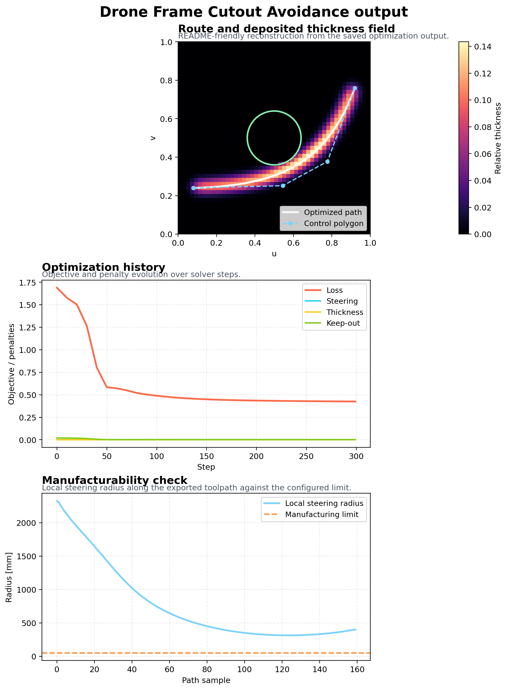
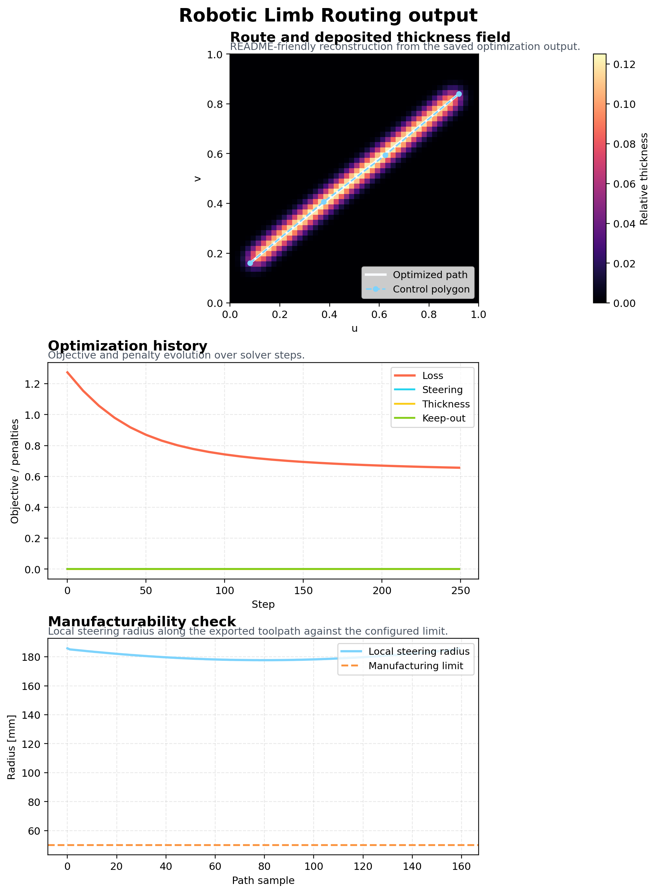

# Autonomy-IFP-Optimizer

IFP path planning in forward-simulation CAM tools is iterative: define a course, evaluate manufacturability, adjust, and rerun. For tight steering limits and cutout keep-outs, that loop can take many manual passes before a manufacturable route appears. This optimizer runs that loop backwards: constraints stay inside the loss function and gradients drive the path directly to a feasible solution. On the plate-with-hole demo, the saved result reduces the compliance proxy by `46.6%` and moves keep-out clearance from `-0.137 uv` intrusion to `+0.040 uv` clearance while keeping the entire toolpath above the `50 mm` steering-radius limit.


## Verified Results

The repository currently ships two saved demonstration runs in `outputs/`. The tables below compare the initial Bezier-course baseline against the final optimized result using the same load case and constraint settings.

### Drone Frame Cutout Avoidance

| Metric | Baseline | Optimized | Change |
| --- | ---: | ---: | ---: |
| Compliance proxy | 0.614 | 0.328 | -46.6% |
| Steering violations (`< 50 mm`) | 0 | 0 | unchanged |
| Minimum steering radius | 711.1 mm | 313.2 mm | still +263.2 mm above limit |
| Thickness uniformity (`std / mean`) | 3.472 | 2.877 | -17.1% |
| Keep-out clearance | -0.137 uv | +0.040 uv | intrusion removed |
| Estimated cycle time | 1.075 s | 1.122 s | +4.4% |
| Estimated material usage | 0.439 g | 0.859 g | +95.9% |

### Robotic Limb Routing

| Metric | Baseline | Optimized | Change |
| --- | ---: | ---: | ---: |
| Compliance proxy | 1.232 | 0.612 | -50.3% |
| Steering violations (`< 50 mm`) | 0 | 0 | unchanged |
| Minimum steering radius | 180.3 mm | 177.7 mm | still +127.7 mm above limit |
| Thickness uniformity (`std / mean`) | 2.895 | 2.902 | +0.2% |
| Keep-out clearance | n/a | n/a | no keep-out zone |
| Estimated cycle time | 1.345 s | 1.345 s | +0.0% |
| Estimated material usage | 0.503 g | 1.008 g | +100.4% |

The important pattern is visible in both demos: the optimizer reduces the compliance proxy while respecting the manufacturing steering limit. The plate-with-hole case is the stronger proof point because the optimizer converts an initial keep-out violation into positive clearance without introducing steering failures.

## Output

The raw `outputs/*/ifp_preview.png` files are wide three-panel diagnostics. GitHub compresses those figures hard enough that the labels become difficult to read, so the README shows stacked reconstructions generated from the saved run data below. Click either image to open the original full-resolution export.

### Plate With Keep-Out

[](outputs/drone_frame_demo/ifp_preview.png)

### Cylindrical Routing

[](outputs/robotic_limb_demo/ifp_preview.png)

The plots show the path on the surface, the optimization history, and the steering-radius manufacturability check. The preview image is the quickest way to see whether the code produced a route a process engineer would actually inspect further.

## Why Differentiable Path Planning Matters for IFP at Scale

Manual IFP course planning depends on process-engineer judgment to evaluate steering radius compliance, thickness distribution, and keep-out avoidance. That works at prototype volume. At serial-production volume, it becomes a bottleneck: each geometry change, steering-limit change, or new cutout can trigger another manual planning cycle.

Gradient-based path planning embeds those constraints directly in the optimization. When the geometry changes, rerun the optimizer. When the steering limit tightens, update the threshold and rerun. When a keep-out zone is added, add it to the signed-distance constraint and rerun. The result is parameter-driven and reproducible instead of relying on manual path sketching.

The `Autonomy` in the repository name refers to that architecture: when the input geometry or process constraints change, the planner can search for a new manufacturable path without restarting the workflow from a hand-authored course definition.

## Optimization Model

Manufacturability is part of the optimization state, not a post-processing check.

The planner optimizes one cubic Bezier course at a time. Two internal control points and a continuous thickness scale are the design variables. The total loss is:

```text
total_loss =
  structural_weight * compliance_proxy
  + length_weight * length_ratio
  + steering_weight * steering_penalty
  + thickness_weight * thickness_penalty
  + keepout_weight * keepout_penalty
  + boundary_weight * boundary_penalty
  + smoothness_weight * smoothness_penalty
```

### Physical Basis Of The Terms

- `compliance_proxy`
  The user provides a global load vector through `LoadCase.direction_xyz`. That vector is projected onto the local surface tangent plane to obtain a preferred local fiber direction. The structural weighting field is analytic, not FEM-based: on the plate-with-hole surface it is a Gaussian band across the plate width plus an annular ring around the circular cutout; on the cylinder it is an axial Gaussian term plus a circumferential modulation. The proxy rewards tangent alignment with that weighted preferred direction. It is a heuristic alignment model, not a laminate or shell solve.
- `steering_penalty`
  Path curvature is computed from the sampled 3D Bezier curve and converted to a local steering-radius profile. The penalty activates when the local radius falls below the configured minimum. The default `50 mm` limit is a provisional conservative placeholder, roughly in the range used for a `6.35 mm (0.25 in)` tow-width fiber-damage limit; it should be calibrated to the specific tow, head curvature, and material system.
- `thickness_penalty`
  A Gaussian deposition kernel is accumulated over a `coverage_grid x coverage_grid` UV grid using the sampled path and `tow_half_width_uv`. The thickness field is masked outside valid surface regions and penalized for two things: exceeding `max_thickness` and developing high variance over the valid area. In the results tables above, the reported thickness-uniformity metric is `std / mean`.
- `keepout_penalty`
  Keep-out zones are circles in UV parameter space with a signed-distance field. A softplus barrier penalizes path samples that enter or approach the forbidden zone.
- `boundary_penalty`
  Penalizes UV coordinates that leave the valid `[0, 1] x [0, 1]` parameter domain.
- `smoothness_penalty`
  Penalizes the second difference of the Bezier control polygon to suppress erratic control-point movement.

## Surrogate Component

The Flax surrogate does not learn a higher-fidelity structural model. It learns the same Bezier-path objective terms used by the differentiable solver:

- total loss
- compliance proxy
- steering penalty
- thickness penalty
- keep-out penalty

That means its accuracy ceiling is bounded by the fidelity of the proxy objective itself. Its value is inference speed, not extra physics.

### Saved Smoke-Test Metrics

The checked-in smoke test in `outputs/surrogate_smoke/surrogate_metrics.json` reports:

- training samples: `64`
- epochs: `10`
- validation normalized MSE: `1.591`
- validation RMSE: `14.535`
- surrogate inference latency: `8.50 ms`

### Warm-Cache Batch Benchmark

On this environment, a warm `jax.jit` batch evaluation of `13` candidate paths takes approximately:

- full objective batch: `7.80 ms`
- surrogate batch: `0.34 ms`
- measured speedup: `22.9x`

The intended workflow is:

1. Use the surrogate to screen many candidate courses quickly.
2. Use the differentiable solver to refine the best candidates under the full objective.

## CLI Workflow

Run the full differentiable optimization on the plate-with-hole demo:

```bash
python main.py optimize --mesh examples/drone_plate.obj --load 500 --min-radius 50
```

Export robot-facing kinematics from an existing optimized path:

```bash
python main.py export --input outputs/optimized_path.json --format json
```

Train the Flax surrogate on generated samples:

```bash
python main.py train-surrogate --samples 1000 --epochs 250
```

Switch to the cylindrical demo:

```bash
python main.py optimize --surface cylinder --load 650 --direction 0,0,1
```

## Python API

```python
from autonomy_ifp_optimizer import GeometryConfig, LoadCase, OptimizationConfig, load_surface, optimize_ifp_path
from autonomy_ifp_optimizer.export.toolpath import compute_metrics

surface = load_surface(
    mesh="examples/drone_plate.obj",
    geometry_config=GeometryConfig(surface="plate_with_hole"),
)
result = optimize_ifp_path(
    surface,
    load_case=LoadCase(magnitude_n=500.0, direction_xyz=(1.0, 0.0, 0.0)),
    config=OptimizationConfig(),
)
metrics = compute_metrics(result)

print(metrics["objective"])
print(metrics["min_steering_radius_mm"])
print(metrics["estimated_cycle_time_s"])
```

## Generated Artifacts

After `optimize`, the repository writes:

- `outputs/optimized_path.json`
  Full optimization result including control points, sampled path, normals, tangents, steering-radius profile, objective terms, and iteration history
- `outputs/metrics.json`
  Manufacturability and process metrics including cycle time, material usage, and steering-radius compliance
- `outputs/ifp_kinematics.json` or `outputs/ifp_kinematics.csv`
  Robot-ready kinematic records with XYZ positions, surface normals, tangents, binormals, arc length, and local steering radius
- `outputs/ifp_preview.png`
  Preview figure showing the path, thickness map, optimization history, and manufacturability check

After `train-surrogate`, the repository writes:

- `outputs/surrogate_dataset.npz`
- `outputs/surrogate_params.msgpack`
- `outputs/surrogate_metrics.json`

To regenerate the README summary assets from the saved demo outputs:

```bash
python tools/generate_readme_assets.py
```

## Example Notebooks

- `examples/drone_frame_cutout_avoidance.ipynb`
  Plate-with-hole workflow from geometry inspection through optimization, toolpath export, and process metrics.
- `examples/robotic_limb_optimization.ipynb`
  Cylindrical workflow from surface setup through optimized routing, robotic kinematics export, and manufacturing metrics.

## Repository Components

- `core/geometry.py`
  Defines the analytic surfaces, tangent-plane projection, keep-out signed-distance field, and the analytic stress-weight maps used by the compliance proxy.
- `core/physics.py` and `core/constraints.py`
  Optimize cubic Bezier IFP paths with JAX autodiff and evaluate the structural, steering, thickness, keep-out, boundary, and smoothness terms.
- `export/toolpath.py`
  Converts optimized paths into robot-ready kinematic records and process metrics.
- `ai_surrogate/train_flax_model.py`
  Generates path samples and trains the Flax surrogate that approximates the Bezier objective.

## Repository Layout

```text
Autonomy-IFP-Optimizer/
  assets/
    demo_showcase.png
    drone_frame_output_breakdown.png
    toolpath_diagnostics.png
    optimization_profiles.png
    robotic_limb_output_breakdown.png
  examples/
    drone_frame_cutout_avoidance.ipynb
    robotic_limb_optimization.ipynb
    drone_plate.obj
  outputs/
    drone_frame_demo/
    robotic_limb_demo/
    surrogate_smoke/
  src/autonomy_ifp_optimizer/
    ai_surrogate/
      train_flax_model.py
    core/
      constraints.py
      geometry.py
      physics.py
    export/
      toolpath.py
    cli.py
    config.py
    visualize.py
  tools/
    generate_readme_assets.py
  main.py
```

## Scope and Limitations

This repository validates the differentiable path-planning architecture on analytic surface families. It is intentionally limited in several important ways:

- The structural model is a path-tangent alignment proxy with analytic stress weighting, not a full laminate or shell solve.
- The planner optimizes one Bezier course at a time. It does not do coverage planning, multi-course sequencing, seam management, or overlap scheduling.
- The current demos are a plate with a circular cutout and a cylindrical surface. Extension to double-curvature automotive or motorsport panels requires imported NURBS or triangulated surfaces and a parameterization strategy for optimizing on that geometry.
- The robot export provides local tool orientation from surface normals and tangents, but it does not do joint-space planning, collision checking, or singularity avoidance.

Those limits are deliberate. The goal here is to prove that gradient-based constraint enforcement can drive an IFP path directly to a manufacturable solution before scaling the geometry representation and planning complexity.
