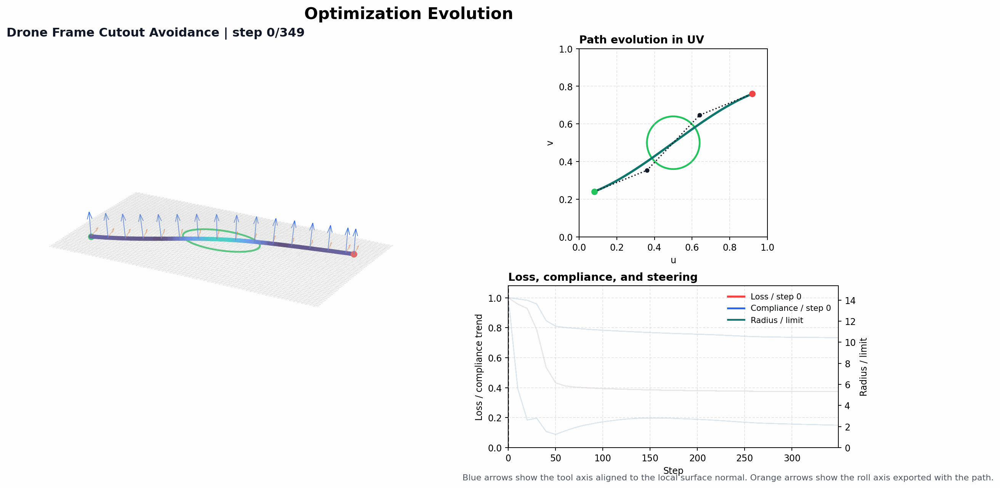
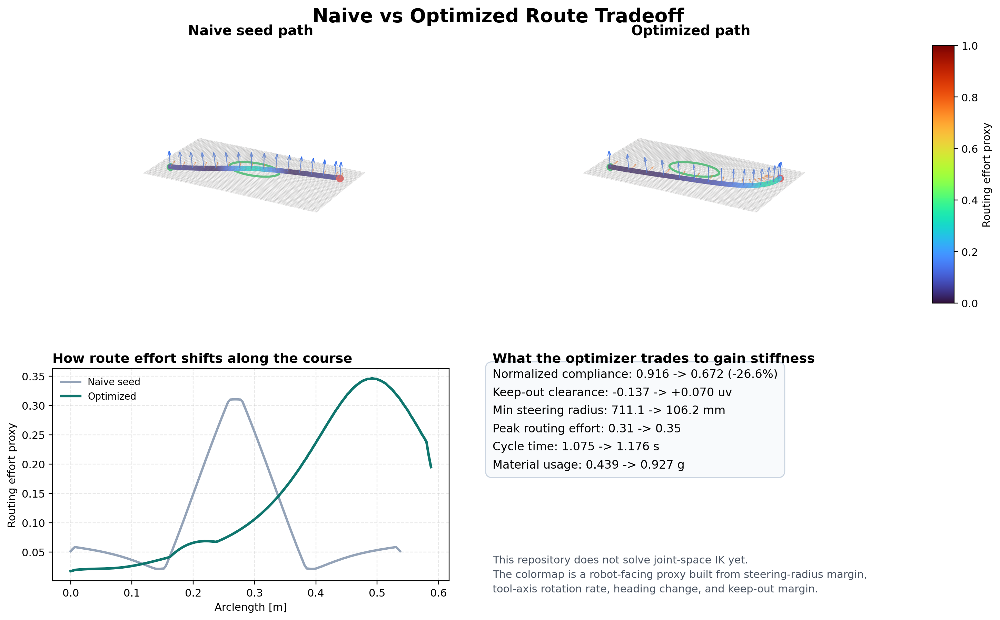
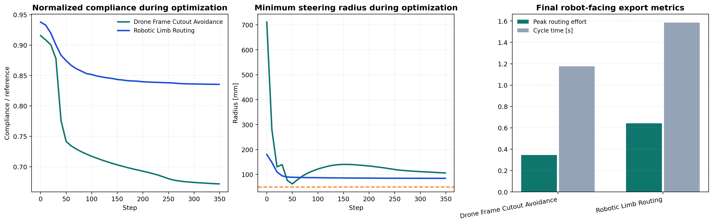
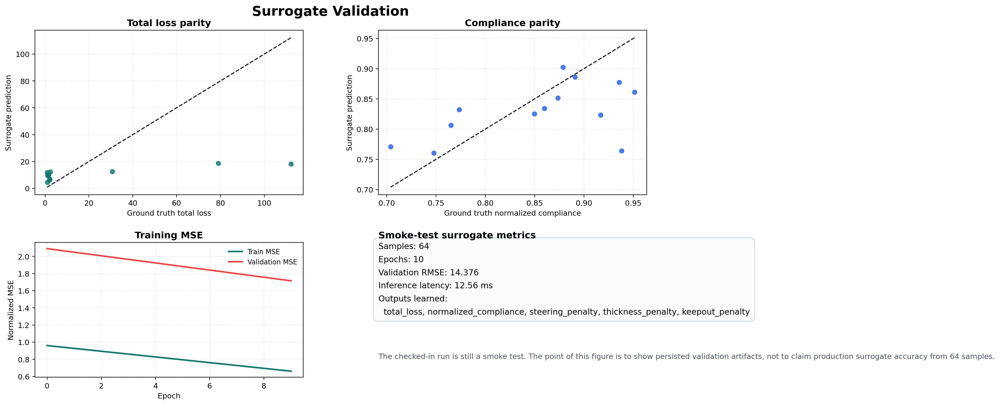

# Autonomy-IFP-Optimizer

Autonomy-IFP-Optimizer is a differentiable Infinite Fiber Placement route planner. It optimizes one cubic Bezier course and one thickness scale directly against an orthotropic membrane FEM, steering-radius limits, thickness buildup, keep-out zones, boundary limits, and control-polygon smoothness.

The repository now ships the visual proof with the solver: a saved optimization-evolution GIF, a paired-case showcase figure, a baseline-vs-optimized route comparison, optimization-profile plots, persisted surrogate-validation data, and interactive Plotly HTML exports for the checked-in demo runs.



The hero GIF above is generated from the saved `frames` snapshots in `optimized_path.json`. It shows how the route, Bezier control polygon, and convergence curves evolve together during the optimizer run.

## What It Solves

- Re-route a single IFP course around keep-outs while improving structural stiffness against a real membrane FEM, not a heuristic alignment score.
- Keep steering radius, thickness buildup, boundary limits, and keep-out clearance inside the same differentiable objective.
- Export robot-facing path records with XYZ, tool axis, roll axis, arc length, and local steering radius.
- Persist an interactive 3D HTML view so the surface mesh, final route, and local tool frame can be inspected directly.
- Train a Flax surrogate on FEM-labeled samples and save validation predictions for README-quality error plots.

Current scope is deliberate: this repo optimizes one course at a time and exports local tool frames. It does not solve robot joint-space IK, collision checking, or singularity avoidance yet.

## Visual Proof



The plate-with-hole demo is the clearest saved example. The optimized path removes a `-0.137 uv` cutout intrusion, improves normalized compliance from `0.916` to `0.672`, and still stays above the `50 mm` steering-radius limit. It does that by accepting a more demanding turn near the keep-out, so the route-effort proxy rises from `0.31` to `0.35`. The figure is labeled that way on purpose: it is showing a real trade, not pretending the optimized route is universally easier.

The route-effort colormap is a robot-facing proxy built from steering-radius margin, tool-axis rotation rate, heading change, and keep-out margin. That is the strongest honest metric the current repo can support before a full IK layer exists.

## Saved Demo Results

The repository includes two saved runs in `outputs/` with a baseline seed path and the final optimized result.

### Drone Frame Cutout Avoidance

| Metric | Baseline | Optimized | Change |
| --- | ---: | ---: | ---: |
| Normalized compliance | 0.916 | 0.672 | -26.6% |
| Loaded-edge displacement | 0.228 mm | 0.169 mm | -26.0% |
| Peak von Mises stress | 6.36 MPa | 11.09 MPa | +74.4% |
| Keep-out clearance | -0.137 uv | +0.070 uv | intrusion removed |
| Minimum steering radius | 711.1 mm | 106.2 mm | still +56.2 mm above limit |
| Peak routing effort proxy | 0.31 | 0.35 | +11.6% |
| Estimated cycle time | 1.075 s | 1.176 s | +9.4% |
| Estimated material usage | 0.439 g | 0.927 g | +111.4% |

This is the best saved proof case in the repo right now: the route clears the hole, improves stiffness materially, and stays manufacturable against the configured steering limit.

### Robotic Limb Routing

| Metric | Baseline | Optimized | Change |
| --- | ---: | ---: | ---: |
| Normalized compliance | 0.938 | 0.835 | -10.9% |
| Loaded-edge displacement | 0.191 mm | 0.171 mm | -10.4% |
| Peak von Mises stress | 2.90 MPa | 4.86 MPa | +67.5% |
| Minimum steering radius | 180.3 mm | 84.7 mm | still +34.7 mm above limit |
| Peak routing effort proxy | 0.355 | 0.643 | +81.1% |
| Estimated cycle time | 1.345 s | 1.586 s | +17.9% |
| Estimated material usage | 0.549 g | 1.245 g | +126.9% |

The cylinder case proves the same differentiable loop runs on curved geometry and improves stiffness there too. It is not the cleanest manufacturing trade yet, which is why the README leads with the plate-with-hole case.


The showcase figure above puts both checked-in demos side by side with the exact metrics exported in `outputs/*/metrics.json`. The cylinder demo has no keep-out zones, so the visual summary now renders that field as `n/a` instead of leaking the internal sentinel value used by the solver.

## Optimization Profiles



The profile plot makes the optimization behavior legible without opening notebooks. The plate-with-hole run shows the sharper compliance drop, while both demos stay above the `50 mm` steering-radius limit throughout the saved optimization history.

## Interactive Output

GitHub does not render checked-in `.html` files inline. In the repo browser it shows the HTML source, not the Plotly scene. Open these files locally in a browser after cloning or downloading the repository:

- `outputs/drone_frame_demo/interactive_toolpath.html`
- `outputs/robotic_limb_demo/interactive_toolpath.html`

Each HTML export is now self-contained. It includes the reconstructed surface mesh, the baseline seed path, the optimized path, and sampled tool-axis / roll-axis vectors without depending on a remote Plotly CDN.

## Current Workflow

At every optimization step, the solver:

1. samples one cubic Bezier course in UV and maps it onto the analytic surface and the FEM mid-surface coordinates,
2. derives local tangent and normal directions and a Gaussian tow-footprint field,
3. assembles an orthotropic `tri3` membrane stiffness field on a conformal Gmsh mesh,
4. solves the reduced linear system for nodal displacements and evaluates compliance, and
5. combines structural and manufacturing penalties into one scalar loss before taking an Adam step.

The current loss is:

```text
total_loss =
  structural_weight * normalized_compliance
  + length_weight * length_ratio
  + steering_weight * steering_penalty
  + thickness_weight * thickness_penalty
  + keepout_weight * keepout_penalty
  + boundary_weight * boundary_penalty
  + smoothness_weight * smoothness_penalty
```

The optimizer now saves both scalar `history` and geometric `frames` snapshots every `history_stride` steps. Those saved frames are what drive the GIF in `assets/optimization_evolution.gif`.

## Surrogate Validation



The checked-in surrogate artifact is still a smoke test, not a benchmark. The current saved run uses `64` samples and `10` epochs, reaches validation RMSE `14.376`, and reports inference latency `12.56 ms`.

What changed in the workflow is more important than the absolute number: the repo now persists `outputs/surrogate_smoke/surrogate_validation.npz` with `y_true`, `y_pred`, and `target_names`, so the validation figure is generated from saved artifacts instead of a notebook-only plot.

The surrogate predicts:

- `total_loss`
- `normalized_compliance`
- `steering_penalty`
- `thickness_penalty`
- `keepout_penalty`

## Quick Start

Optimize the plate-with-hole demo:

```bash
python main.py optimize --surface plate_with_hole --load 500 --min-radius 50 --outdir outputs/drone_frame_demo
```

Optimize the cylindrical demo:

```bash
python main.py optimize --surface cylinder --load 650 --direction 0,0,1 --outdir outputs/robotic_limb_demo
```

Re-export robot-facing artifacts from an existing path JSON:

```bash
python main.py export --input outputs/drone_frame_demo/optimized_path.json --format json --outdir outputs/drone_frame_demo
```

Train a larger surrogate run:

```bash
python main.py train-surrogate --samples 1000 --epochs 250 --batch-size 64 --surface plate_with_hole --outdir outputs/surrogate_run
```

Regenerate the README assets from the saved demo outputs:

```bash
python tools/generate_readme_assets.py
```

## Python API

```python
from autonomy_ifp_optimizer import GeometryConfig, LoadCase, OptimizationConfig, load_surface, optimize_ifp_path
from autonomy_ifp_optimizer.export.toolpath import compute_metrics, write_interactive_toolpath_html

surface = load_surface(
    surface="plate_with_hole",
    geometry_config=GeometryConfig(surface="plate_with_hole"),
)
result = optimize_ifp_path(
    surface,
    load_case=LoadCase(magnitude_n=500.0, direction_xyz=(1.0, 0.0, 0.0)),
    config=OptimizationConfig(),
)
metrics = compute_metrics(result)
write_interactive_toolpath_html(result, "outputs/demo")

print(metrics["normalized_compliance"])
print(metrics["min_steering_radius_mm"])
print(metrics["peak_routing_effort"])
```

## Generated Artifacts

After `optimize`, the repository writes:

- `outputs/*/optimized_path.json`
  Full optimization result including the final path, `baseline`, `history`, `frames`, and the serialized FEM response.
- `outputs/*/metrics.json`
  Structural, manufacturability, and process metrics including compliance, displacement, stress, cycle time, material usage, and the routing-effort proxy.
- `outputs/*/interactive_toolpath.html`
  Self-contained Plotly export with the surface mesh, baseline seed path, optimized path, tool axis, and roll axis. Open this locally in a browser; GitHub will show the HTML source instead of rendering it.
- `outputs/*/ifp_kinematics.json` or `outputs/*/ifp_kinematics.csv`
  Robot-facing path records with XYZ, normals, tangents, binormals, arc length, and local steering radius.
- `outputs/*/ifp_preview.png`
  Static FEM preview with displacement, stress, optimization history, and steering-radius compliance.

After `train-surrogate`, the repository writes:

- `outputs/*/surrogate_dataset.npz`
- `outputs/*/surrogate_params.msgpack`
- `outputs/*/surrogate_metrics.json`
- `outputs/*/surrogate_validation.npz`

The README asset script writes:

- `assets/optimization_evolution.gif`
- `assets/naive_vs_optimized_heatmap.png`
- `assets/surrogate_validation.png`
- `assets/demo_showcase.png`
- `assets/optimization_profiles.png`

## Limitations

- The planner currently optimizes one course at a time. It does not do multi-course sequencing, overlap scheduling, or coverage planning.
- The structural model is an orthotropic membrane FEM with a dense direct solve. It is not a full shell model and does not include bending, progressive damage, or ply drop logic.
- The geometry stack supports analytic plate and cylinder families with Gmsh-generated conformal meshes. Arbitrary CAD shell extraction is not implemented.
- The robot export provides local tool frames only. There is no joint-space planning, collision checking, or singularity avoidance in the current repo.

Those limits are intentional. The goal of this repository is to show a differentiable IFP route optimizer that couples real structural response, manufacturing constraints, robot-facing exports, and surrogate infrastructure in one coherent workflow.
