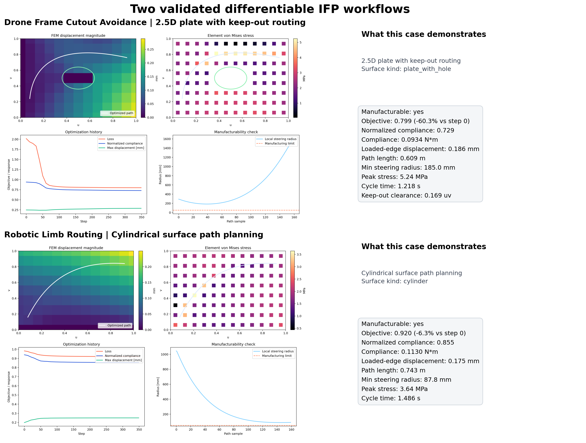
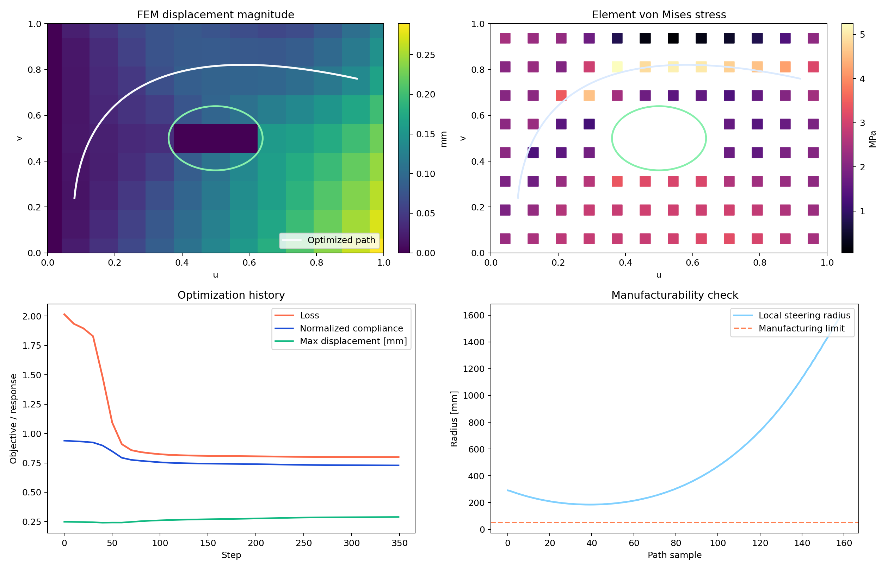
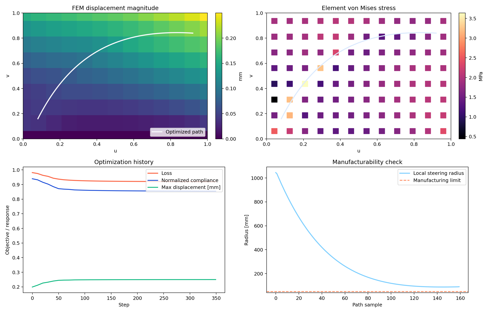

# Autonomy-IFP-Optimizer

Autonomy-IFP-Optimizer is a differentiable path planner for Infinite Fiber Placement that couples one Bezier fiber course to an orthotropic membrane finite-element solve. Instead of scoring a path with an alignment heuristic, the structural term assembles element membrane stiffness matrices, solves for nodal displacements, and minimizes compliance `C = f^T u` inside the optimization loop. On the plate-with-hole demo, the saved run reduces FEM compliance from `0.1205 N*m` to `0.0934 N*m` (`-22.4%`) while moving the path from `-0.137 uv` cutout intrusion to `+0.169 uv` clearance and keeping the entire route above the `50 mm` steering-radius limit.

The current implementation optimizes one fiber course at a time; multi-course cooperative routing is the next architectural step.



## Verified Results

The repository ships two saved demonstration runs in `outputs/`. The tables below compare the initial Bezier baseline against the final optimized result using the same loads, FEM mesh, and manufacturing constraints.

### Drone Frame Cutout Avoidance

| Metric | Baseline | Optimized | Change |
| --- | ---: | ---: | ---: |
| FEM compliance `f^T u` | 0.1205 N*m | 0.0934 N*m | -22.4% |
| Normalized compliance | 0.939 | 0.729 | -22.4% |
| Loaded-edge displacement | 0.240 mm | 0.186 mm | -22.5% |
| Minimum steering radius | 711.1 mm | 185.0 mm | still +135.0 mm above limit |
| Peak thickness field | 0.075 | 0.138 | below 1.20 limit |
| Keep-out clearance | -0.137 uv | +0.169 uv | intrusion removed |
| Estimated cycle time | 1.075 s | 1.218 s | +13.3% |
| Estimated material usage | 0.439 g | 0.959 g | +118.7% |

### Robotic Limb Routing

| Metric | Baseline | Optimized | Change |
| --- | ---: | ---: | ---: |
| FEM compliance `f^T u` | 0.1242 N*m | 0.1130 N*m | -9.0% |
| Normalized compliance | 0.940 | 0.855 | -9.0% |
| Loaded-edge displacement | 0.191 mm | 0.175 mm | -8.5% |
| Minimum steering radius | 180.3 mm | 87.8 mm | still +37.8 mm above limit |
| Peak thickness field | 0.066 | 0.131 | below 1.20 limit |
| Keep-out clearance | n/a | n/a | no keep-out zone |
| Estimated cycle time | 1.345 s | 1.486 s | +10.5% |
| Estimated material usage | 0.549 g | 1.165 g | +112.3% |

The plate-with-hole case is the stronger structural demo because the optimizer reduces FEM compliance and clears the cutout without creating steering failures. The cylindrical case shows the same FEM loop working on an unwrapped curved surface with an axial load.

## Output

The saved `outputs/*/ifp_preview.png` files now show FEM response, not a structural proxy. Each preview contains the solved in-plane displacement field, element von Mises stress, optimization history, and steering-radius compliance.

### Plate With Keep-Out

[](outputs/drone_frame_demo/ifp_preview.png)

### Cylindrical Routing

[](outputs/robotic_limb_demo/ifp_preview.png)

## Structural Model

Manufacturability is part of the optimization state, but the structural term is now a finite-element solve rather than an analytic alignment score.

The optimizer treats one cubic Bezier course and one continuous thickness scale as the design variables. At every gradient step it:

1. samples the Bezier course in UV and maps it onto the surface and the mid-surface FEM coordinates,
2. builds a local fiber-orientation field from the path tangent and a Gaussian tow-footprint field,
3. assembles an orthotropic membrane stiffness for every active element,
4. solves the reduced linear system for nodal displacements, and
5. combines compliance with the manufacturing penalties into one scalar objective.

The loss is:

```text
total_loss =
  structural_weight * normalized_compliance
  + length_weight * length_ratio
  + steering_weight * steering_penalty
  + thickness_weight * thickness_penalty
  + keepout_weight * keepout_penalty
  + boundary_weight * boundary_penalty
  + smoothness_weight * smoothness_penalty
```

### Finite-Element Formulation

The structural solve uses a structured bilinear Q4 membrane mesh on the surface parameterization (`12 x 8` by default). The plate-with-hole demo removes elements inside the keep-out so the cutout is part of the stiffness model rather than only a routing penalty. The cylinder is solved on its unwrapped `(s, z)` mid-surface.

For each element:

```text
A_e = t_matrix * Q_iso + t_fiber(u, v) * Qbar(theta)
K_e = integral(B^T * A_e * B dA)
```

where:

- `Q_iso` is an isotropic plane-stress matrix for the baseline laminate,
- `Qbar(theta)` is the rotated orthotropic ply constitutive matrix,
- `t_fiber(u, v)` comes from a smooth tow-footprint field tied to the current path, and
- `B` is the standard membrane strain-displacement matrix for the bilinear quad.

The global system is assembled and reduced to the free degrees of freedom:

```text
K_ff * u_f = f_f
compliance = f^T * u
normalized_compliance = compliance / compliance_reference
```

`compliance_reference` is the response of the matrix-only baseline membrane for the same mesh and load case. That keeps the structural term well-scaled for optimization while preserving an actual FEM compliance value in the outputs.

### Manufacturing Constraints in the Gradient Loop

- `steering_penalty`
  Uses the sampled 3D Bezier curvature and activates when the local steering radius falls below the configured minimum.
- `thickness_penalty`
  Accumulates a Gaussian deposition field on a `coverage_grid x coverage_grid` UV grid and penalizes over-thickness and non-uniform buildup.
- `keepout_penalty`
  Applies a softplus signed-distance barrier around holes, inserts, and cutouts.
- `boundary_penalty`
  Penalizes UV coordinates outside the valid parameter domain.
- `smoothness_penalty`
  Penalizes the second difference of the Bezier control polygon.

The same `thickness_scale` variable appears in both the manufacturing thickness field and the FEM reinforcement field, so the route is trading off real stiffness response against manufacturability rather than optimizing two unrelated models.

## Why Differentiable Path Planning Matters for IFP

Manual IFP programming is usually an outer loop: sketch a course, run a structural or manufacturability check, adjust the route, and repeat. That loop becomes a bottleneck when the steering limit changes, a cutout moves, or a new surface variant arrives.

This repository keeps the structural solve and the manufacturing penalties inside the same differentiable objective. When the geometry or process limits change, rerun the optimizer and get a new route with updated stiffness, displacement, steering, thickness, and keep-out behavior rather than restarting from a hand-authored path.

## Surrogate Component

The Flax surrogate is trained on FEM-labeled optimizer outputs, not on an alignment proxy. It predicts:

- total loss,
- normalized compliance,
- steering penalty,
- thickness penalty, and
- keep-out penalty.

The checked-in smoke test in `outputs/surrogate_smoke/surrogate_metrics.json` reports:

- training samples: `64`
- epochs: `10`
- validation normalized MSE: `1.859`
- validation RMSE: `15.010`
- surrogate inference latency: `9.64 ms`

The intended workflow is to use the surrogate to screen many candidate courses quickly, then refine promising candidates with the full differentiable FEM objective.

## CLI Workflow

Run the full optimization on the plate-with-hole demo:

```bash
python main.py optimize --mesh examples/drone_plate.obj --load 500 --min-radius 50
```

Switch to the cylindrical demo:

```bash
python main.py optimize --surface cylinder --load 650 --direction 0,0,1
```

Export robot-facing kinematics from an existing optimized path:

```bash
python main.py export --input outputs/optimized_path.json --format json
```

Train the Flax surrogate on generated samples:

```bash
python main.py train-surrogate --samples 1000 --epochs 250
```

Note: the current mesh loader maps imported geometry onto one of two analytic surface families (plate-with-hole or cylinder) based on the part bounding box and filename. Arbitrary surface parameterization is not implemented yet.

## Python API

```python
from autonomy_ifp_optimizer import GeometryConfig, LoadCase, OptimizationConfig, load_surface, optimize_ifp_path
from autonomy_ifp_optimizer.export.toolpath import compute_metrics

surface = load_surface(
    mesh="examples/drone_plate.obj",
    geometry_config=GeometryConfig(surface="plate_with_hole"),
)
result = optimize_ifp_path(
    surface,
    load_case=LoadCase(magnitude_n=500.0, direction_xyz=(1.0, 0.0, 0.0)),
    config=OptimizationConfig(),
)
metrics = compute_metrics(result)

print(metrics["compliance_n_m"])
print(metrics["maximum_displacement_mm"])
print(metrics["min_steering_radius_mm"])
```

## Generated Artifacts

After `optimize`, the repository writes:

- `outputs/optimized_path.json`
  Full optimization result including control points, path samples, steering-radius profile, and a `fem` block with nodal displacements, element membrane matrices, element strains, and element stresses.
- `outputs/metrics.json`
  Structural, manufacturability, and process metrics including compliance, displacement, stress, cycle time, and material usage.
- `outputs/ifp_kinematics.json` or `outputs/ifp_kinematics.csv`
  Robot-facing path records with XYZ positions, surface normals, tangents, binormals, arc length, and local steering radius.
- `outputs/ifp_preview.png`
  Preview figure showing FEM displacement magnitude, element von Mises stress, optimization history, and manufacturability.

After `train-surrogate`, the repository writes:

- `outputs/surrogate_dataset.npz`
- `outputs/surrogate_params.msgpack`
- `outputs/surrogate_metrics.json`

To regenerate the README assets from the saved demo outputs:

```bash
python tools/generate_readme_assets.py
```

## Example Notebooks

- `examples/drone_frame_cutout_avoidance.ipynb`
  Plate-with-hole workflow from geometry inspection through optimization, FEM response, toolpath export, and process metrics.
- `examples/robotic_limb_optimization.ipynb`
  Cylindrical workflow from surface setup through optimized routing, FEM response, robotic kinematics export, and manufacturing metrics.

## Repository Components

- `core/fem.py`
  Builds the structured membrane mesh, assembles orthotropic element stiffness matrices, applies edge loads and constraints, and solves for nodal displacements.
- `core/physics.py`
  Couples the Bezier design variables to the FEM response and the manufacturing penalties inside one differentiable objective.
- `core/constraints.py`
  Evaluates steering, thickness, keep-out, boundary, and smoothness penalties.
- `core/geometry.py`
  Defines the analytic surfaces, surface parameterizations, keep-out signed-distance fields, and mid-surface coordinates used by the FEM model.
- `export/toolpath.py`
  Converts optimized paths into robot-ready kinematic records and process metrics.
- `ai_surrogate/train_flax_model.py`
  Generates FEM-labeled samples and trains the Flax surrogate that approximates the optimizer objective.

## Repository Layout

```text
Autonomy-IFP-Optimizer/
  assets/
    demo_showcase.png
    drone_frame_output_breakdown.png
    toolpath_diagnostics.png
    optimization_profiles.png
    robotic_limb_output_breakdown.png
  examples/
    drone_frame_cutout_avoidance.ipynb
    robotic_limb_optimization.ipynb
    drone_plate.obj
  outputs/
    drone_frame_demo/
    robotic_limb_demo/
    surrogate_smoke/
  src/autonomy_ifp_optimizer/
    ai_surrogate/
      train_flax_model.py
    core/
      constraints.py
      fem.py
      geometry.py
      physics.py
    export/
      toolpath.py
    cli.py
    config.py
    visualize.py
  tools/
    generate_readme_assets.py
  main.py
```

## Scope and Limitations

This repository is materially stronger than the earlier heuristic model, but it is still a reduced-order structural planner rather than a production composite analysis stack.

- The structural term is an orthotropic membrane FEM. It does not include bending stiffness, out-of-plane displacement, progressive damage, ply drop-off logic, or a full shell formulation.
- The plate and cylinder demos use analytic surface families and structured meshes. Arbitrary CAD parameterization and imported shell meshes are not implemented.
- The planner optimizes one Bezier course at a time. It does not do coverage planning, multi-course sequencing, seam management, or overlap scheduling.
- The robot export provides local tool orientation from the optimized surface path, but it does not do joint-space planning, collision checking, or singularity avoidance.

Those limits are deliberate. The goal of this repository is to show that a differentiable IFP route can be optimized against an actual stiffness solve and manufacturing constraints at the same time, before scaling the geometry and planning stack further.
