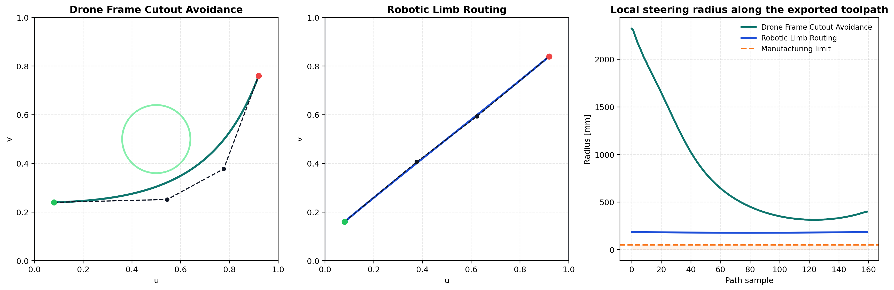

# Autonomy-IFP-Optimizer

Autonomy-IFP-Optimizer is a differentiable path-planning package for Infinite Fiber Placement (IFP) robotics. It optimizes robot-ready fiber routes while structural alignment, steering-radius limits, thickness buildup, and keep-out geometry all remain inside the same JAX optimization loop.


## What The Package Does

The optimizer jointly solves for:

- Bezier control points on supported analytic IFP surfaces
- continuous deposition / thickness scaling
- structural alignment with the target load direction
- local steering-radius compliance
- thickness smoothness across the laydown field
- keep-out avoidance around holes and cutouts
- export-ready path samples, normals, tangents, and process metrics

The repository includes two saved end-to-end demonstration results:

- `drone_frame_demo`
  A plate-with-hole case where the route bends around a central cutout while staying well above the steering-radius limit.
- `robotic_limb_demo`
  A cylindrical routing case that converges to a manufacturable layup on a limb-like surface.

## Result Snapshot

These values come directly from the checked-in output artifacts in `outputs/`.

| Demo | Surface | Objective | Path length (m) | Min steering radius (mm) | Cycle time (s) | Material (g) | Manufacturable |
| --- | --- | ---: | ---: | ---: | ---: | ---: | --- |
| Drone frame cutout avoidance | Plate with keep-out | 0.425 | 0.561 | 313.19 | 1.122 | 0.859 | Yes |
| Robotic limb routing | Cylinder | 0.656 | 0.672 | 177.68 | 1.345 | 1.008 | Yes |

The plate-with-hole run also keeps a positive keep-out clearance of `0.040 uv`, and both demos remain comfortably above the manufacturing steering limit of `50 mm`.

## What The Toolpath Looks Like



The left and center panels show the optimized UV-space route for each case, including the control polygon behind the differentiable Bezier path. The right panel shows the local steering radius along the exported toolpath. In both workflows, every sampled point stays above the manufacturing limit.

## How The Optimization Converges


The drone-frame case drops from an initial loss of `1.690` to `0.425` (`-74.8%`), while the robotic-limb case drops from `1.274` to `0.656` (`-48.5%`). The steering-radius history shows the plate-with-hole case tightening near the cutout before relaxing back into a robust manufacturable solution.

## Minimal API

```python
from autonomy_ifp_optimizer import GeometryConfig, LoadCase, OptimizationConfig, load_surface, optimize_ifp_path
from autonomy_ifp_optimizer.export.toolpath import compute_metrics

surface = load_surface(
    mesh="examples/drone_plate.obj",
    geometry_config=GeometryConfig(surface="plate_with_hole"),
)
result = optimize_ifp_path(
    surface,
    load_case=LoadCase(magnitude_n=500.0, direction_xyz=(1.0, 0.0, 0.0)),
    config=OptimizationConfig(),
)
metrics = compute_metrics(result)

print(metrics["objective"])
print(metrics["min_steering_radius_mm"])
print(metrics["estimated_cycle_time_s"])
```

Use the CLI when you want complete output bundles written to disk:

```bash
python main.py optimize --mesh examples/drone_plate.obj --load 500 --min-radius 50
python main.py export --input outputs/optimized_path.json --format json
python main.py train-surrogate --samples 1000 --epochs 250
```

## Generated Artifacts

After `optimize`, the repository writes:

- `outputs/optimized_path.json`
  Full optimization result including control points, sampled path, history, and objective terms
- `outputs/metrics.json`
  Manufacturability and process metrics including steering radius, cycle time, and material estimate
- `outputs/ifp_kinematics.json` or `outputs/ifp_kinematics.csv`
  Robot-consumable kinematic arrays with XYZ positions and local frame vectors
- `outputs/ifp_preview.png`
  Preview figure with thickness map, optimization history, and manufacturability check

After `train-surrogate`, the repository writes:

- `outputs/surrogate_dataset.npz`
- `outputs/surrogate_params.msgpack`
- `outputs/surrogate_metrics.json`

To regenerate the README figures from the saved demo outputs:

```bash
python tools/generate_readme_assets.py
```

## Repository Layout

```text
Autonomy-IFP-Optimizer/
  assets/
    demo_showcase.png
    toolpath_diagnostics.png
    optimization_profiles.png
  examples/
    drone_frame_cutout_avoidance.ipynb
    robotic_limb_optimization.ipynb
    drone_plate.obj
  outputs/
    drone_frame_demo/
    robotic_limb_demo/
    surrogate_smoke/
  src/autonomy_ifp_optimizer/
    ai_surrogate/
      train_flax_model.py
    core/
      constraints.py
      geometry.py
      physics.py
    export/
      toolpath.py
    cli.py
    config.py
    visualize.py
  tools/
    generate_readme_assets.py
  main.py
```

## Scope

This is a technical prototype, not a production planning backend. The current implementation is intentionally scoped around analytic surfaces that keep the optimization differentiable and stable:

- 2.5D plate-with-hole parts for cutout-routing demonstrations
- cylindrical parts for tubular IFP routing
- single-path optimization with continuous deposition scaling

That scope is deliberate. It validates the planning architecture before scaling into richer imported geometries, multi-course planning, collision-aware robot kinematics, and tighter manufacturing-software integration.
